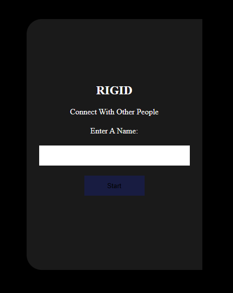
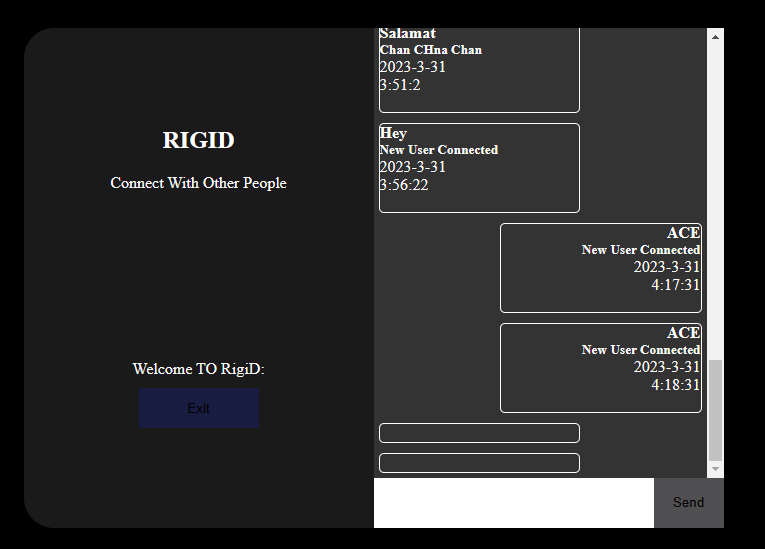

# RIGID
 

RIGID is a simple web application that uses Firebase's Realtime Database to enable real-time chat communication between users. The app also allows users to read and write data to the database.

The app is built with HTML, CSS, and JavaScript, and it uses Firebase's JavaScript SDK to interact with the Realtime Database.
